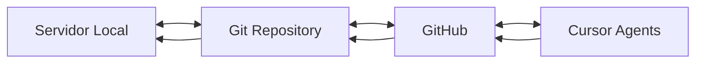

# PENIN Monorepo - Sistema de Evolução Contínua

<div align="center">


**Sistema PENIN com Sincronização Bidirecional GitHub ↔ Servidor**  
*Evolução Automática do Zero ao State-of-the-Art*

</div>

---

## 🚀 Status do Sistema

| Métrica | Valor |
|---------|-------|
| **Última Sincronização** | 2025-09-25T19:12:51.134038 |
| **Total de Arquivos** | 8 |
| **Total de Linhas** | 231 |
| **Agentes Ativos** | 8 |
| **Modo de Operação** | Bidirecional 24/7 |

## 🤖 Agentes Cursor Ativos

Os seguintes agentes estão monitorando e evoluindo o código continuamente:

| Agente | Função | Status |
|--------|--------|--------|
| **Code Optimizer** | Otimização de performance e refatoração | ✅ Ativo |
| **Security Guardian** | Análise de segurança e correção de vulnerabilidades | ✅ Ativo |
| **Evolution Engine** | Implementação de melhorias e novos recursos | ✅ Ativo |
| **Sync Coordinator** | Coordenação de sincronização bidirecional | ✅ Ativo |

## 📊 Distribuição de Código

### Linguagens
- **.md**: 6 arquivos (75.0%)
- **.py**: 1 arquivos (12.5%)


## 🔄 Sincronização Bidirecional

### Como Funciona

1. **Servidor → GitHub**: Mudanças locais são detectadas e enviadas automaticamente
2. **GitHub → Servidor**: Mudanças no GitHub (PRs, commits diretos) são puxadas automaticamente
3. **Resolução de Conflitos**: Agentes resolvem conflitos automaticamente
4. **Monitoramento 24/7**: Sistema roda continuamente sem intervenção

### Fluxo de Dados



## 🛠️ Componentes do Sistema

### ET Ultimate
- **Caminho**: `opt/et_ultimate/`
- **Descrição**: Sistema de IA central
- **Módulos**: Neural core, processamento, memória

### Machine Learning
- **Caminho**: `ml/`
- **Descrição**: Modelos e algoritmos de ML
- **Status**: Em evolução contínua

### PENIN Omega
- **Caminho**: `penin_omega/`
- **Descrição**: Sistema de auto-evolução
- **Status**: Ativo

### Projetos
- **Caminho**: `projetos/`
- **Descrição**: Projetos experimentais
- **Status**: Múltiplos ativos

## 📈 Evolução Automática

O sistema evolui automaticamente através de:

1. **Análise Contínua**: Agentes analisam o código 24/7
2. **Melhorias Automáticas**: Implementação de otimizações
3. **Correções Proativas**: Bugs são corrigidos antes de causar problemas
4. **Documentação Viva**: README e docs sempre atualizados
5. **Aprendizado Contínuo**: Sistema aprende com cada iteração

## 🔒 Segurança

- ✅ Análise contínua de vulnerabilidades
- ✅ Detecção de secrets e credenciais
- ✅ Correção automática de issues de segurança
- ✅ Compliance com melhores práticas

## 📝 Logs e Monitoramento

Acompanhe o sistema em tempo real:

```bash
# Ver logs do sistema
journalctl -u penin-sync -f

# Status dos agentes
penin status

# Logs de sincronização
tail -f /opt/penin-autosync/logs/bidirectional_sync.log
```

## 🌐 Webhooks e Integração

- **GitHub Webhooks**: Configurados para notificar mudanças
- **Cursor API**: Integração completa com agentes
- **Slack**: Notificações de eventos importantes (opcional)

## 🚦 Como Contribuir

Este sistema aceita contribuições através de:

1. **Pull Requests no GitHub**: Serão analisados pelos agentes
2. **Commits Diretos**: Para colaboradores autorizados
3. **Issues**: Agentes respondem e implementam soluções

## 📄 Licença

MIT License - Sistema de código aberto para evolução contínua

---

<div align="center">

**Sistema PENIN - Evolução Infinita**  
*Sincronizado em 2025-09-25 19:12:51*  
*Versão: Auto-evolutiva*

[GitHub](https://github.com/danielgonzagat/penin-monorepo) | 
[Cursor Dashboard](https://cursor.com/dashboard) | 
[Documentação](https://github.com/danielgonzagat/penin-monorepo/wiki)

</div>
